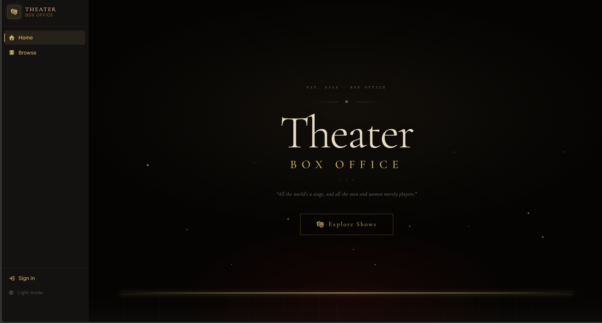
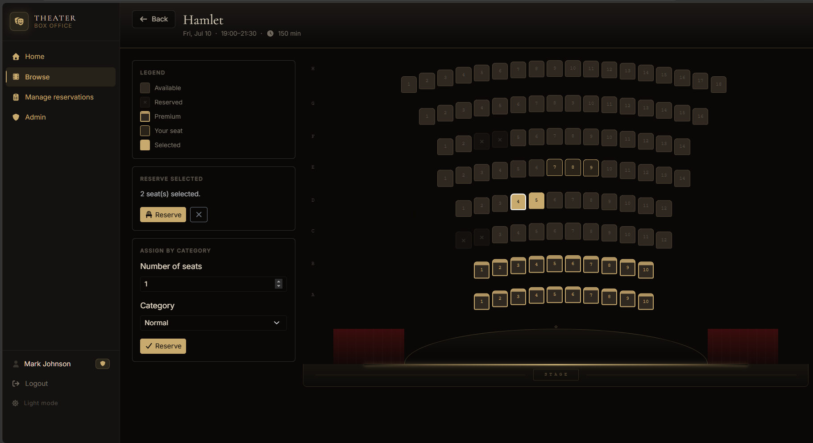
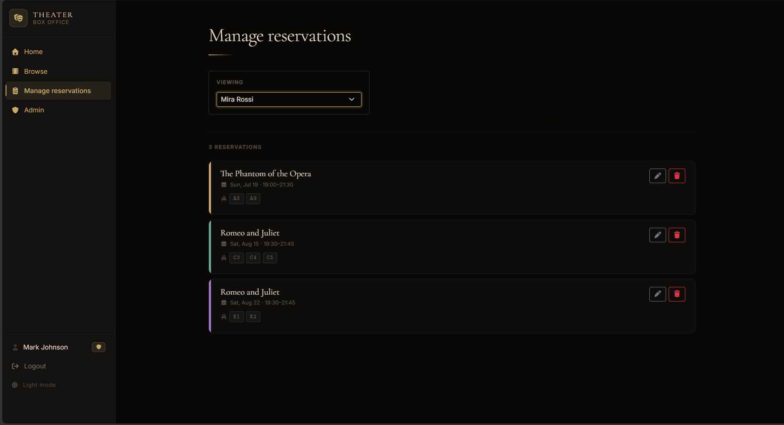
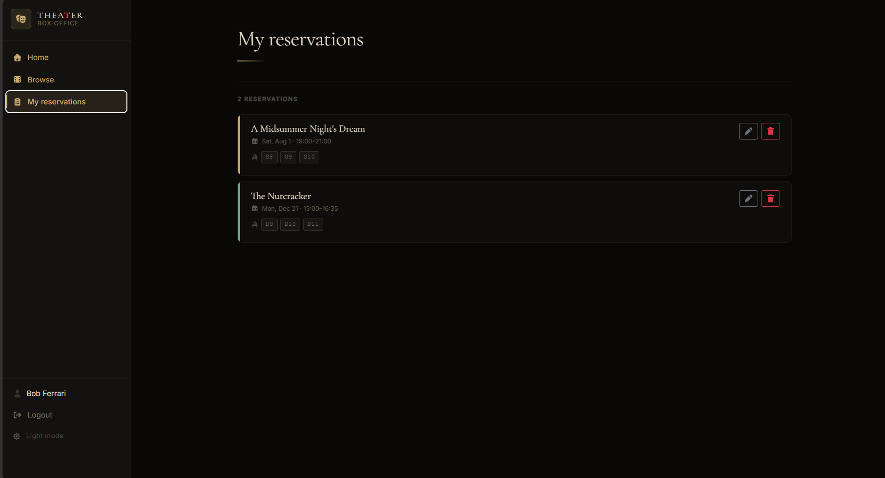
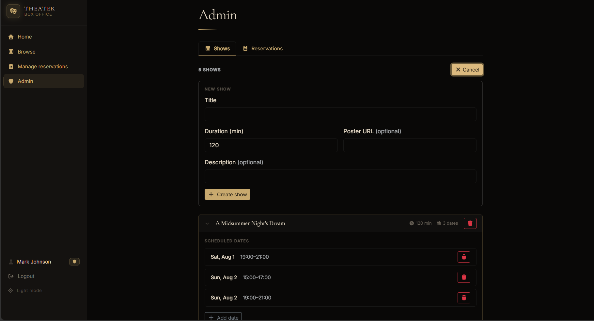
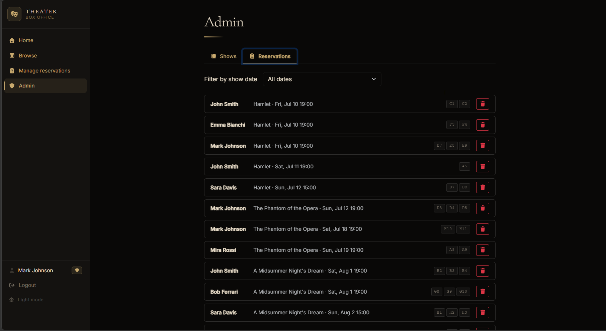

Student: s353229 DUKA ADEA

# Theater - seat reservation app

A web application for browsing shows, viewing the theater seat map, and managing reservations, built with React (client) + Express/SQLite (server).

## Running the project

```bash
cd server; nodemon index.mjs
```

```bash
cd client; npm run dev
```

- Client: http://localhost:5173
- Server API: http://localhost:3001

On first run the server creates and seeds `server/theater.db` automatically (idempotent - safe to restart).

An optional `server/.env` (see `server/.env.example`) can override `SESSION_SECRET` and `TOTP_SECRET`; both have working fallback defaults so the app runs on a fresh clone with no `.env` file.

---

### Two-factor authentication (TOTP)

Admin-capable users (`mark`, `tom`) must complete a TOTP step if they choose to act as admin at login.

**Per-user secret storage**: every admin user has the TOTP secret stored in their own `totp_secret` column in the `users` table. The same secret value (`LXBSMDTMSP2I5XFXIYRGFVWSFI`) is used for all admin users per the exam specification, but it is stored as a separate row per user - not as a shared global. Verification reads `req.user.totp_secret` from the deserialized session user (fetched from DB), never from a module-level constant.

**`totpVerified` is session-scoped**: when a user passes TOTP, `req.session.totpVerified = true` is set on that user's individual express-session. Other active sessions are unaffected. The flag is destroyed on logout.

For development convenience the server prints the current valid code to its console every 30 seconds:

```
[dev] current TOTP code: 123456
```

(This log is suppressed when `NODE_ENV=production`.)

### Seeded users

| Username | Password | Role |
|---|---|---|
| john  | johnpw1  | regular user |
| mark  | markpw1  | admin (TOTP required to act as admin) |
| sara  | sarapw1  | regular user |
| tom   | tompw1   | admin (TOTP required to act as admin) |
| mira | mirapw1 | regular user |
| bob   | bobpw1   | regular user |
| emma  | emmapw1  | regular user |

---

## Server-side

### HTTP API

All routes are prefixed with `/api`. **auth** = requires a logged-in session; **admin** = additionally requires `is_admin` + TOTP-verified session.

| Method & path | Auth | Body / params | Returns |
|---|---|---|---|
| `GET /api/health` | - | - | `{ status: 'ok' }` |
| `POST /api/sessions` | - | `{ username, password }` | `{ id, username, name, isAdmin, isTotpVerified }`, 401 on bad credentials |
| `GET /api/sessions/current` | auth | - | same shape as above, 401 if not logged in |
| `DELETE /api/sessions/current` | auth | - | 204, destroys the session |
| `POST /api/sessions/totp` | auth | `{ code }` | verifies code against user's own `totp_secret`; sets `totpVerified` on session; returns user object with `isTotpVerified: true`; 401 if invalid |
| `GET /api/shows` | - | - | `[{ id, title, description, posterUrl, duration, dates: [{ id, date, time, endTime }] }]` |
| `GET /api/shows/:id` | - | - | single show, same shape; 404 if not found |
| `GET /api/seats` | - | `?showDateId=` optional | layout only (no status) without param; adds `status` (`available`/`reserved`) scoped to that show date with param |
| `GET /api/reservations` | auth | `?userId=` (admin only) | array of `{ id, userId, showDateId, date, time, endTime, showTitle, createdAt, seats: [{ id, row, number, category }] }` |
| `POST /api/reservations` | auth | `{ showDateId, seatIds }` or `{ showDateId, count, category }` | 201 + created reservation; 400/409 with descriptive `{ error }` |
| `PUT /api/reservations/:id` | auth (owner or admin) | `{ addSeatIds, removeSeatIds }` | updated reservation; 400/403/404/409 with `{ error }` |
| `DELETE /api/reservations/:id` | auth (owner or admin) | - | 204; starts 40s re-booking cooldown for the reservation's original owner |
| `GET /api/users` | admin | - | `[{ id, username, name }]` |
| `GET /api/admin/shows` | admin | - | same shape as `GET /api/shows` |
| `POST /api/admin/shows` | admin | `{ title, duration, description?, posterUrl? }` | 201 + created show |
| `DELETE /api/admin/shows/:id` | admin | - | 204; 409 if the show has reservations |
| `POST /api/admin/shows/:showId/dates` | admin | `{ date, time }` | 201 + `{ id, showId, date, time, endTime }`; endTime auto-computed |
| `DELETE /api/admin/shows/:showId/dates/:dateId` | admin | - | 204; 409 if the date has reservations |
| `GET /api/admin/reservations` | admin | `?showDateId=` optional | all reservations with seats |
| `DELETE /api/admin/reservations/:id` | admin | - | 204 |

### Database tables (`server/theater.db`, SQLite)

| Table | Purpose | Columns |
|---|---|---|
| `users` | users and credentials | `id`, `username` (unique), `name`, `password_hash` (bcrypt), `is_admin`, `totp_secret` (nullable; stored per-user even when value is shared) |
| `seats` | theater layout | `id`, `row_label`, `seat_number`, `category` (`normal`/`premium`), unique on `(row_label, seat_number)` |
| `shows` | shows available for booking | `id`, `title`, `description`, `poster_url`, `duration` (minutes) |
| `show_dates` | individual performance dates | `id`, `show_id`, `date` (YYYY-MM-DD), `time` (HH:MM), `end_time` (HH:MM, auto-computed) |
| `reservations` | one row per booking | `id`, `user_id`, `show_date_id`, `created_at` |
| `reservation_seats` | seats belonging to a reservation | `reservation_id`, `seat_id` (composite PK) |
| `seat_cooldowns` | 40s re-booking cooldown per user/seat/show date | `seat_id`, `user_id`, `show_date_id`, `released_at` (composite PK) |

---

## Client-side

### Routes

| Route | Purpose |
|---|---|
| `/` | Landing page - theatrical welcome screen with animated curtains and CTA to browse shows |
| `/shows` | Browse shows - hero banner for the featured show, scrollable show grid; accessible to anonymous users |
| `/shows/:showId` | Show detail - description, duration, date picker chips; anonymous users can view the seat map without selecting |
| `/shows/:showId/dates/:dateId` | Seat selection - interactive seat map for a specific show date; users can reserve by direct click or by count+category; anonymous users see a read-only map |
| `/login` | Login form - credentials step, then optional admin-choice step (proceed as admin → TOTP, or continue as regular user) |
| `/reservations` | My reservations - list of reservations with seat map shown only during edit; TOTP-verified admins can switch user and manage any reservation |
| `/admin` | Admin panel (TOTP-verified admins only) - manage shows and dates, browse all reservations |

### Main React components

| Component | Purpose |
|---|---|
| `Sidebar` | Persistent left nav - app branding, nav links, user display, login/logout, dark/light theme toggle, admin badge |
| `SeatMap` | Renders the theater grid; supports available/reserved/premium/own-seat states, per-reservation color markers, click-to-select, curved auditorium layout |
| `SeatLegend` | Color key shown alongside the seat map |
| `Proscenium` | Decorative stage arch rendered below the seat map |
| `ShowCard` | Poster card in the browse grid |
| `ReservationCard` | Single reservation row with inline edit (add/remove seats) and delete confirm flow |
| `Toast` | Fixed-position success/error notification |
| `AuthContext` | Provides `user`, `loading`, `login`, `logout`, `verifyTotp` to the whole app |
| `ProtectedRoute` | Redirects to `/login` if not authenticated |
| `AdminRoute` | Redirects to `/` if not a TOTP-verified admin |

---

## Requirements checklist

| Requirement | Status |
|---|---|
| Theater ≥ 100 seats, ≥ 4 rows, ≥ 3 rows of different length, each row ≥ 8 seats | Done |
| Premium seats in first 2 rows | Done |
| Seat map visible to non-registered users | Done |
| Reserve seats by direct selection on the map | Done |
| Reserve seats by count + category (same-row when possible) | Done |
| Manage reservations page - view all confirmed reservations, each in a different color | Done |
| Modify reservation - add and/or remove seats through map | Done |
| Delete reservation at once | Done |
| Admin can modify/delete any user's reservations (not create on behalf of others) | Done |
| Admin chooses at login whether to act as admin; admin role requires TOTP | Done |
| 40-second re-booking cooldown per user per seat; cooldown owner = original reservation owner | Done |
| Descriptive error messages for all operation failures | Done |
| passport.js + session cookies; hashed + salted passwords (bcrypt) | Done |
| Multiple-server pattern - CORS configured; React in development/StrictMode | Done |
| React + Express + SQLite | Done |
| TOTP with `LXBSMDTMSP2I5XFXIYRGFVWSFI`; secret stored per-user in DB | Done |
| No `window.confirm` / `alert` / `prompt` / `window.location.reload` | Done |
| No hardcoded IDs; IDs always created server-side | Done |
| Server-side authorization checks on all write routes | Done |
| ≥ 4 users, exactly 2 admins, ≥ 4 reservations owned by exactly 2 users (1 admin + 1 regular) | Done |
| ≥ 20 non-reserved seats | Done |
| README with API list, DB tables, routes, components, usernames/passwords | Done |
| Screenshot of seat selection page in README | Done |

---

## Screenshots

### Landing page


### Browse shows


### Seat selection


### Manage reservations (edit mode)


### My reservations list


### Admin - Shows


### Admin - Reservations

